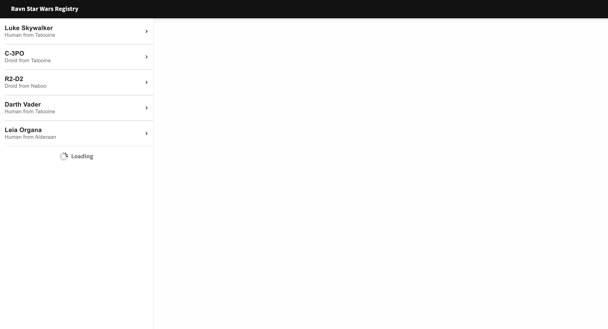
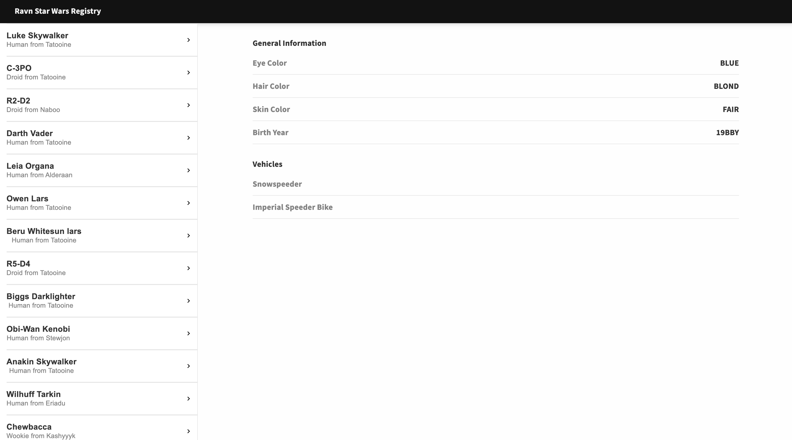
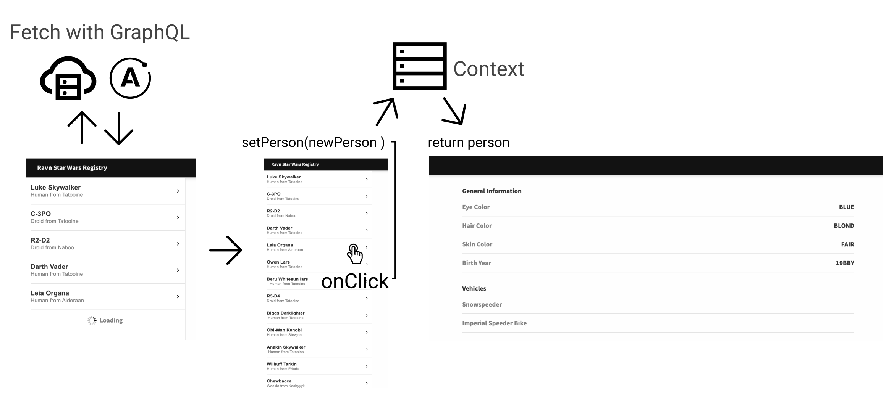

# Ravn-Challenge-V2
Ravn-Challenge-V2 is a challenge project of the RAVN company developing for the web using React JS library, Webpack, GraphQL and Apolo Client.

## Requirements

## Running Instructions:

1. Clone this repo or download it and place yourself in the root of the project. 
2.  Run the following command to install all dependencies
    ```bash
    npm install
    ```

3. Once installed all dependencies, run one of the next commands.
- Run local in development mode
  ```bash
  npm run dev
  ```
  Open your browser in  
  ```bash
  http://localhost:3000/
  ```
- Compile in production mode 
  ```bash
  npm run build
  ```
- Compile in development mode 
  ```bash
  npm run pre-build
  ```
- Deploy to Vercel.app
  ```bash
  npm run vercel-build
  ```
  Make sure you have `vercel cli` installed and have an account of `vercel.com`. If not, create an account in [https://vercel.com/](https://vercel.com/)
  and install `vercel cli` with this command
  ```bash
  npm i -g vercel
  ```

- Check eslint errors
  ```bash
  npm run lint
  ```

## Application Flow

- Application start fetching the endpoint with Apollo Cli and showing every character in the sidebar.

- By clicking on any item on the sidebar, the app will show the detail of that item in the right side by setting the item in "People Info" component using React Context

- Finally the app flow could be expressed like this


## Dependencies & Technologies


## Configurations
- ### Webpack
  To change configurations about babel, file extensions, compilation of the project or change the port, go to `webpack.json` file.

- ### Eslint
  This project use `Estandard JS` as slint configuration, to change or disabale, run
  ```bash
  npm uninstall standard
  ```

  and delete slint configurations in the `package.json` file including the script slint
  ```json
  //...
  "scripts": {
    "lint": "standard",
  },
  //...
  "standard": {
    "ignore": [
      "/api/**"
    ]
  },
  "eslintConfig": {
    "parser": "babel-eslint",
    "extends": [
      "./node_modules/standard/eslintrc.json"
    ]
  }
  ```


## Licence
[MIT](https://choosealicense.com/licenses/mit/)


